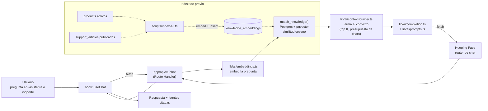

# MercadoTech

Marketplace de compra/venta de productos tecnológicos (tipo Mercado Libre), con un asistente de
compras y un centro de soporte operados por un pipeline de IA (RAG) propio.

**Producción:** [mercadotech-pi.vercel.app](https://mercadotech-pi.vercel.app)

> Este proyecto nació como el trabajo práctico del curso "Claude Code for Developers" — la
> planeación original del curso, sesión por sesión, quedó preservada en
> [`docs/PLAN_CURSO.md`](docs/PLAN_CURSO.md). Este README describe el producto tal como existe hoy,
> no el plan.

## Qué es

- **Comprador**: catálogo con búsqueda semántica, favoritos, carrito, checkout transaccional,
  historial de pedidos, reseñas y preguntas por producto, asistente de compras conversacional.
- **Vendedor**: alta de productos (galería con drag & drop), panel de pedidos tipo kanban
  (drag & drop entre estados), estadísticas de su tienda, storefront público (`/tienda/[sellerId]`).
- **Admin**: gestión de usuarios y estadísticas globales.
- **Soporte**: asistente de IA que responde citando artículos reales de la base de conocimiento
  (RAG sobre `support_articles`), con fallback a tickets humanos.

## Stack

- **Next.js 15** (App Router) + **React 19** + **TypeScript**, desplegado en **Vercel**
- **Supabase**: Postgres + Auth + Storage + RLS + `pgvector`
- **IA (nivel gratuito de Hugging Face)**: `sentence-transformers/all-MiniLM-L6-v2` (embeddings,
  384 dims, vía SDK `@huggingface/inference`) + modelo de chat configurable por variable de entorno
  (el catálogo gratuito de HF rota sin aviso — ver `lib/constants/ai.ts`)
- **TailwindCSS v4** + **shadcn/ui** (Base UI)
- **Testing**: Vitest (unit) + Playwright (E2E) · **CI/CD**: GitHub Actions + Vercel (Git
  integration, branch protection en `main`)
- **MCP**: servidor propio de solo lectura sobre `@modelcontextprotocol/sdk` (`mercadotech/mcp/`)

## Arquitectura, en una imagen

```
components/       Presentación PURA — recibe props, no hace fetching, no conoce Supabase.
hooks/            Estado de cliente — llaman a services, sin lógica de negocio propia.
services/         Lógica de negocio — cliente Supabase INYECTABLE (browser por default),
                  así hooks, Route Handlers y tests comparten la misma función.
lib/supabase/     4 clientes: browser (anon), server (cookies+RLS), middleware, admin (service role).
lib/ai/           ÚNICOS archivos que conocen la API del proveedor de IA.
lib/constants/    Todos los tunables (IA, roles, catálogo, pedidos...) centralizados.
app/api/v1/       Route Handlers delgados — SOLO lo que no puede correr en el navegador
                  (secretos de IA, cliente admin): chat, reindex, search/semantic.
mcp/              Servidor MCP — consumidor más de services/ y lib/ai/, nunca reimplementa lógica.
```

Un único camino de datos: `components → hooks → services → Supabase (RLS)`. RLS es la única
autoridad de qué fila puede tocar cada quien — no hay una capa de permisos paralela en la
aplicación. Detalle completo, decisiones de diseño y el porqué de cada una →
[`docs/ARQUITECTURA.md`](docs/ARQUITECTURA.md).

## Flujo RAG (asistente de compras y soporte)



Los 6 tunables del pipeline (modelo de embeddings, modelo de chat, dimensión del vector, top K,
threshold de similitud, presupuesto de contexto) viven en `lib/constants/ai.ts`, nunca hardcodeados.
Los 6 casos de prueba y la calibración real → [`docs/RAG.md`](docs/RAG.md).

## Puesta en marcha local

Prerrequisitos: Node 20+, Docker corriendo (para el Supabase local), cuenta gratuita de
[Hugging Face](https://huggingface.co) (token de tipo "Read").

```bash
# 1. Clonar e instalar
git clone https://github.com/JackelineOrtiz/mercadotech.git
cd mercadotech/mercadotech      # el proyecto Next.js vive en esta subcarpeta

npm install                     # corre "postinstall": patch-package solo — ver nota abajo

# 2. Levantar Supabase local (requiere Docker)
supabase start                  # imprime API_URL, ANON_KEY, SERVICE_ROLE_KEY locales
supabase db reset               # aplica las migraciones + carga supabase/seed.sql

# 3. Variables de entorno
cp .env.example .env.local
# Completar con los valores que imprimió "supabase start" (Supabase) y tu token de
# Hugging Face (HUGGINGFACEHUB_API_TOKEN) — nunca los valores de producción acá.

# 4. Levantar el servidor de desarrollo
npm run dev                     # http://localhost:3000
```

**Nota — `patch-package`:** el `postinstall` de `npm install` aplica un patch de una línea sobre
`node_modules/next/dist/compiled/ua-parser-js/ua-parser.js` (`patches/next+15.5.23.patch`) — corrige
un `__dirname` inerte que rompe el middleware en el runtime Edge real de Vercel (nunca en local).
Es automático, no requiere ningún paso manual. Detalle → [`docs/DEPLOY.md`](docs/DEPLOY.md) §2.3.

Usuarios de prueba (creados por `supabase/seed.sql`, contraseña `MercadoTech123!` para los 6):
`buyer1@mercadotech.test` / `buyer2@mercadotech.test` / `buyer3@mercadotech.test` (compradores),
`seller1@mercadotech.test` / `seller2@mercadotech.test` (vendedores), `admin1@mercadotech.test`
(admin).

Para indexar el contenido de soporte en el asistente RAG (opcional, requiere
`HUGGINGFACEHUB_API_TOKEN` real en `.env.local`):

```bash
npx tsx scripts/index-all.ts
```

## Comandos

```bash
npm run dev            # servidor de desarrollo (Turbopack)
npm run build           # build de producción (Webpack — ver nota de Turbopack en DEPLOY.md)
npm run start            # sirve el build de producción
npm run lint               # ESLint
npm run type-check           # tsc --noEmit
npm run db:types               # regenera types/database.ts desde el Supabase local
npx tsx scripts/index-all.ts     # indexa productos activos + artículos publicados
```

## Testing

```bash
npm run test            # Vitest — lógica pura + services, sin red, no necesita Supabase arriba
npm run test:coverage    # ídem + reporte en coverage/

# E2E (Playwright) — requiere Supabase local arriba y una BD limpia:
supabase db reset
npm run test:e2e
```

CI (GitHub Actions, `.github/workflows/ci.yml`) corre ambas suites en cada push/PR contra un
Supabase efímero, sin ningún secreto — job `checks` (lint + type-check + unit) y job `e2e`
(Playwright en Chromium). `main` tiene branch protection: ambos checks en verde son obligatorios
para poder mergear, sin excepción ni para administradores.

## Deploy

Git integration de Vercel: cada push a una rama con PR abierta genera un preview con su propia URL;
cada merge a `main` (solo posible con CI verde) redespliega producción automáticamente. Sin CLI de
Vercel en el flujo normal, sin secretos en GitHub Actions. Gobernanza de variables/secretos, el
detalle de los 6 bugs reales que salieron desplegando por primera vez, smoke tests post-deploy y el
plan de rollback → [`docs/DEPLOY.md`](docs/DEPLOY.md).

## Servidor MCP

`mercadotech/mcp/` — servidor de solo lectura (Tools/Resources/Prompts) sobre el mismo `services/`
y `lib/ai/` que usa la app. Detalle → [`mcp/README.md`](mercadotech/mcp/README.md).

## Estructura del proyecto

```
mercadotech/                    # raíz del repo
├── README.md                   # este archivo
├── CLAUDE.md                   # guía para Claude Code (arquitectura, convenciones, comandos)
├── docs/                       # documentación técnica
│   ├── PLAN_CURSO.md             # planeación original del curso (histórico)
│   ├── ARQUITECTURA.md            # arquitectura real, capa por capa
│   ├── BITACORA.md                 # registro fase por fase, decisiones y deuda técnica
│   ├── DEPLOY.md                    # variables, flujo de deploy, smoke tests, rollback
│   ├── RAG.md                        # casos de prueba y calibración del pipeline de IA
│   └── DEBUGGING.md                   # metodología y errores típicos encontrados
├── MercadoTech_sesion*.md      # specs de cada sesión del curso
├── .claude/skills/             # 6 Skills de gobernanza (arquitectura, code review, CI...)
└── mercadotech/                # el proyecto Next.js
    ├── app/                    # rutas: (shop) público, (seller) /vendedor, (admin) /admin, (auth)
    ├── components/             # presentación pura, por dominio
    ├── hooks/                  # estado de cliente
    ├── services/               # lógica de negocio, cliente Supabase inyectable
    ├── lib/
    │   ├── supabase/           # 4 clientes (browser/server/middleware/admin)
    │   ├── ai/                 # embeddings, completion, prompts, context-builder
    │   └── constants/          # todos los tunables
    ├── middleware.ts           # auth guard (runtime Edge)
    ├── supabase/               # migraciones, seed, policies, tests RLS
    ├── e2e/                    # Playwright
    ├── patches/                # patch-package (next+15.5.23.patch)
    └── mcp/                    # servidor MCP, paquete npm propio
```
