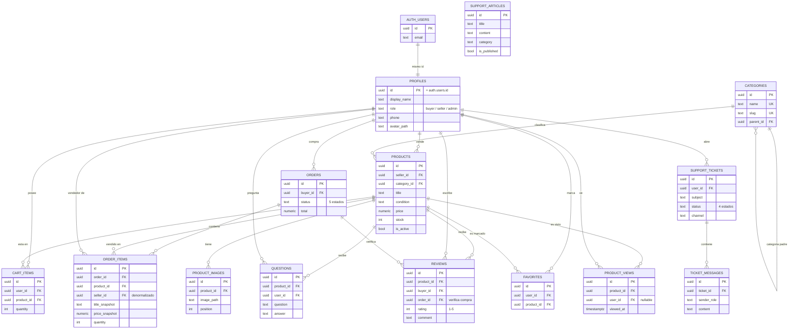

# Arquitectura de MercadoTech

Documento de referencia para cualquier desarrollador que se una al proyecto. Describe lo que
existe HOY en el repositorio, al cierre de la Sesión 7 (Fase 7.5) — infraestructura (Sesión 2),
frontend completo (Sesión 3), pipeline RAG (Sesión 4), gobernanza + MCP (Sesión 5), testing + CI
(Sesión 6) y deploy real a producción (Sesión 7). Si algo acá difiere de una spec de sesión, gana
el código real, con nota. Sesión 8 (agente de voz) es lo único que todavía no existe — ver
[§14](#14-qué-sigue-sesión-8).

## Tabla de contenidos

**Infraestructura (Sesión 2)**
1. [Arquitectura general y capas](#1-arquitectura-general-y-capas)
2. [Organización de carpetas](#2-organización-de-carpetas)
3. [Modelo relacional](#3-modelo-relacional)
4. [Decisiones de diseño](#4-decisiones-de-diseño)
5. [Integración Next.js ↔ Supabase](#5-integración-nextjs--supabase)
6. [Flujo de autenticación](#6-flujo-de-autenticación)
7. [Estrategia de escalabilidad](#7-estrategia-de-escalabilidad)
8. [Políticas RLS por tabla](#8-políticas-rls-por-tabla)

**Producto y operación (Sesiones 3-7)**
9. [Frontend y flujos de usuario (Sesión 3)](#9-frontend-y-flujos-de-usuario-sesión-3)
10. [Pipeline RAG (Sesión 4)](#10-pipeline-rag-sesión-4)
11. [Gobernanza y servidor MCP (Sesión 5)](#11-gobernanza-y-servidor-mcp-sesión-5)
12. [Testing y CI (Sesión 6)](#12-testing-y-ci-sesión-6)
13. [Deploy a producción (Sesión 7)](#13-deploy-a-producción-sesión-7)
14. [Qué sigue (Sesión 8)](#14-qué-sigue-sesión-8)

---

## 1. Arquitectura general y capas

MercadoTech es un monolito Next.js 15 (App Router) sobre Supabase
(Postgres + Auth + Storage). No hay un backend separado: Supabase **es** el
backend, y Next.js habla con él directamente desde el navegador (protegido
por RLS) o desde el servidor cuando la operación no puede exponerse al
cliente (secretos, service role).

La regla que organiza todo el código de negocio (a construirse desde la
Sesión 3) es una cadena de una sola dirección:

```
components/  →  hooks/  →  services/  →  lib/supabase/  →  Postgres (RLS)
(presentación)  (estado)    (lógica)      (clientes)
```

- **`components/`** es presentación pura: recibe props, no hace fetching, no
  sabe que Supabase existe.
- **`hooks/`** maneja estado de cliente (loading, error, datos) llamando a
  `services/`. No tiene lógica de negocio propia.
- **`services/`** tiene la lógica de negocio real. Cada función acepta un
  `SupabaseClient` **inyectable** — por defecto el cliente de navegador —
  para que los mismos services se puedan llamar desde un Route Handler (con
  el cliente de servidor) o desde un test (con un cliente mockeado), sin
  duplicar lógica.
- **`lib/supabase/`** son los únicos archivos que saben construir un
  cliente de Supabase (ver [§5](#5-integración-nextjs--supabase)).
- **`app/api/v1/`** son Route Handlers delgados, reservados para lo que
  estructuralmente no puede correr en el navegador: secretos de proveedores
  de IA (Sesión 4), el cliente `admin` (service role), cookies de sesión en
  contextos que el cliente no puede tocar. **No** es una API REST paralela
  de propósito general — la lección de ReadHub fue exactamente construir
  una capa así y que el frontend nunca la llamara.

Dos capas adicionales, hoy vacías, con una regla fija: **la UI nunca las
importa directamente**.

- **`lib/ai/`** (Sesión 4): únicos archivos que conocen la API del
  proveedor de embeddings/chat.
- **`lib/voice/`** (Sesión 8): únicos archivos que conocen la Web Speech
  API / proveedor de voz.

## 2. Organización de carpetas

Estado real al cierre de la Fase 7.5 (ver [§9](#9-frontend-y-flujos-de-usuario-sesión-3) en
adelante para el detalle de cada capa):

```
mercadotech/
├── app/
│   ├── (auth)/          login, registro, recuperar/actualizar contraseña
│   ├── (shop)/          home, buscar, categoría, producto, carrito, pedidos, favoritos,
│   │                    perfil, tienda/[sellerId], asistente, soporte
│   ├── (seller)/        /vendedor/{productos,publicar,pedidos}
│   ├── (admin)/         /admin, /admin/usuarios
│   ├── api/v1/          chat, reindex, search/semantic — los 3 únicos Route Handlers
│   ├── not-found.tsx · error.tsx · global-error.tsx
│   └── layout.tsx       AuthProvider + CartProvider en la raíz
├── components/          catalog/, product/, cart/, orders/, seller/, chat/, admin/, auth/,
│                        layout/, shared/, ui/ (shadcn/Base UI) — presentación pura
├── hooks/                ~19 hooks (useAuth, useCart, useProducts, useSellerOrders...)
├── services/              ~15 services + su test junto a cada uno
├── lib/
│   ├── supabase/           client.ts · server.ts · admin.ts (middleware.ts se fusionó en
│   │                       middleware.ts raíz — ver docs/DEPLOY.md §2.3, Bug 5)
│   ├── ai/                   embeddings.ts · completion.ts · prompts.ts · context-builder.ts
│   ├── voice/                 vacío — Sesión 8
│   ├── constants/               roles.ts · catalog.ts · orders.ts · product.ts · ai.ts · tickets.ts
│   └── utils.ts
├── types/                tipos de dominio + database.ts (generado)
├── middleware.ts         raíz — auth guard, runtime Edge (patch-package parchea un bug real
│                         de Next.js que rompe el middleware en el Edge real de Vercel)
├── e2e/                  Playwright — pages/ (Page Object Model), tests/, fixtures/, data/
├── patches/              patch-package — next+15.5.23.patch
├── scripts/              index-all.ts (indexado del pipeline RAG)
├── mcp/                  servidor MCP, paquete npm propio (ver §11)
└── supabase/
    ├── migrations/       26 migraciones, fuente de verdad del esquema
    ├── schema.sql        copia de referencia (NO fuente de verdad)
    ├── policies.sql      copia de referencia (NO fuente de verdad)
    ├── seed.sql          datos de laboratorio (local + CI, NUNCA producción)
    └── tests/
        └── rls-validation.sql
```

**Nota de desviación:** la spec original ubicaba `docs/` dentro de
`mercadotech/`. En este repo, `docs/` (y este mismo archivo) vive un nivel
arriba, junto a `README.md`, `CLAUDE.md` y las specs de cada sesión —
separa la documentación del *proyecto de curso* de la documentación técnica
del *código*, pero cumple la misma función. Gana lo construido: este es el
lugar real.

## 3. Modelo relacional

14 tablas en `public`, todas con RLS habilitado. `profiles` es 1:1 con
`auth.users` (gestionada por Supabase Auth, fuera de nuestro control
directo). El DDL completo y versionado está en `supabase/migrations/`;
`supabase/schema.sql` es la copia de lectura rápida.

**Nota de desviación:** la spec de la Fase 2.2 dice "15 entidades" en su
texto de contexto, pero su propia sección `### Entidades` solo define 14 —
son las 14 que existen en el código. No falta ninguna; es una
inconsistencia de conteo en la spec, no una omisión de la implementación.



`SUPPORT_ARTICLES` no tiene relaciones — es contenido plano, base de
conocimiento para el RAG de soporte (Sesión 4).

Referencia SQL completa: [`supabase/schema.sql`](../mercadotech/supabase/schema.sql).

## 4. Decisiones de diseño

**Snapshots en `order_items` (`title_snapshot`, `price_snapshot`).**
Un pedido es un documento histórico: si el vendedor cambia el precio o el
título del producto después, el pedido ya facturado no debe cambiar. Sin
snapshot, el precio mostrado en "mis pedidos" cambiaría retroactivamente
cada vez que el vendedor edita su catálogo.

**`seller_id` denormalizado en `order_items`.**
Podría derivarse con un `join` a `products`, pero la política RLS del
vendedor ("ver ítems donde soy el vendedor") se ejecuta en *cada* fila de
*cada* consulta a `order_items`. Denormalizar evita un `join` extra en el
plan de RLS y, más importante, evita una segunda dependencia circular con
`products` (ya hay una entre `orders` y `order_items`, ver más abajo).

**Checkout como función transaccional (`create_order_from_cart`).**
Crear un pedido no es un solo `insert`: hay que leer el carrito, bloquear
stock, validar disponibilidad, crear la orden, crear los `order_items` con
snapshot, descontar stock y vaciar el carrito — todo o nada. Se implementó
como una función Postgres `SECURITY DEFINER` (bloqueo `for update` sobre
`products` para evitar carreras entre dos checkouts concurrentes) en lugar
de una serie de llamadas desde el cliente, porque desde el cliente no hay
forma de garantizar atomicidad entre pasos. Es además el **único** camino
de escritura a `orders`/`order_items`: ninguna política RLS permite
`insert` directo ahí.

**`product_views` como eventos, no como contador.**
Cada apertura de producto inserta una fila en vez de incrementar un
`view_count` en `products`. Un contador simple no permite responder
"¿cuándo?", "¿quién?" ni analítica temporal, y un `update` por cada vista
compite por el lock de la fila del producto con operaciones más
importantes (compra, edición de stock). Un evento es *append-only*: nunca
bloquea nada.

**Funciones `SECURITY DEFINER` como única forma de evitar recursión de RLS
entre tablas que se referencian mutuamente.**
`orders` necesita saber si el usuario es vendedor de alguno de sus
`order_items`; `order_items` necesita saber si el usuario es el comprador
del `order` al que pertenece. Escribir eso como un `exists (select ...)`
directo contra la otra tabla entra en recursión infinita: RLS se reevalúa
en cada acceso a una tabla sin importar la profundidad, así que
`orders → order_items → orders → ...` nunca termina (Postgres lo reporta
como `infinite recursion detected in policy`). Se resolvió con dos
funciones ayudantes (`is_order_buyer()`, `is_order_seller()`) `SECURITY
DEFINER`: al correr con los privilegios del dueño de la tabla, su consulta
interna no vuelve a pasar por RLS, y el ciclo se rompe. Mismo patrón usa
`is_admin()` para que la política de `profiles` no necesite leer
`profiles` con RLS activo para saber si el usuario es admin.

**Columnas protegidas con `GRANT` de columna, no solo con políticas.**
RLS filtra *filas*, no *columnas*. Para que un usuario pueda editar su
perfil pero no su propio `role` (o que un vendedor pueda responder una
pregunta pero no reescribirla), no alcanza con una política — se usa
`grant update (columnas_permitidas) on tabla to authenticated` en vez de
`grant update on tabla`. `profiles.role` además lleva un trigger
(`protect_profiles_role`) como defensa en profundidad, por si un cambio
futuro de `GRANT` reabre la columna sin querer.

## 5. Integración Next.js ↔ Supabase

Cuatro clientes en `lib/supabase/`, cada uno para un contexto distinto:

| Cliente | Archivo | Contexto | Auth |
|---|---|---|---|
| Browser | `client.ts` | Client Components | `NEXT_PUBLIC_SUPABASE_ANON_KEY`, respeta RLS |
| Server | `server.ts` | Server Components / Server Actions | cookies de sesión (`next/headers`), respeta RLS |
| Middleware | `middleware.ts` | el `middleware.ts` raíz | refresca el token de sesión en cada request |
| Admin | `admin.ts` | Route Handlers server-only | `SUPABASE_SERVICE_ROLE_KEY`, **bypasea RLS** |

`admin.ts` importa `server-only` (el build de Next.js falla si algún
Client Component llega a importarlo, directa o indirectamente) y lleva un
comentario de advertencia en el propio archivo. Es el único cliente que no
respeta RLS — su uso debe justificarse caso por caso (ej. una operación
administrativa que ningún usuario autenticado debería poder hacer ni con
sus propios permisos elevados).

No hay una capa REST propia: todo el acceso a datos pasa por la Data API
de Supabase (PostgREST) usando alguno de estos cuatro clientes, con RLS
como única autoridad de qué fila puede tocar cada quien. `app/api/v1/`
existe para las excepciones explícitas de la Sesión 1 (secretos de IA,
cliente admin, lógica que necesita cookies fuera del alcance de un Server
Component) — no para duplicar lo que la Data API ya resuelve.

## 6. Flujo de autenticación

1. **Login/signup** (Sesión 3): llama a Supabase Auth desde el cliente de
   navegador. Auth crea la fila en `auth.users`.
2. **Trigger `handle_new_user`** (`SECURITY DEFINER`, disparado por Postgres
   al insertar en `auth.users`) crea automáticamente el `profile`
   correspondiente, con `role = 'buyer'` por defecto. Ningún código de
   aplicación crea perfiles manualmente.
3. **Sesión persistida en cookies.** Supabase Auth guarda el access/refresh
   token en cookies httpOnly. `middleware.ts` (raíz) llama a
   `lib/supabase/middleware.ts` en cada request que no sea un asset
   estático: reconstruye el cliente de Supabase desde las cookies de la
   request, llama a `auth.getUser()` (esto refresca el token si venció) y
   reescribe las cookies en la respuesta. Sin este paso, una sesión
   expirada silenciosamente dejaría de funcionar en vez de refrescarse.
4. **Server Components** leen la sesión ya refrescada vía `server.ts`
   (cookies de solo lectura en ese contexto — por eso el refresco activo
   vive en el middleware, no ahí).
5. **Cada request a Postgres lleva el JWT del usuario.** RLS lo lee con
   `auth.uid()` / `auth.role()` — no existe un concepto de sesión del lado
   de la base de datos separado del JWT de la request.

## 7. Estrategia de escalabilidad

- **RLS como única fuente de autorización.** No hay una capa de permisos
  paralela en la aplicación que pueda desincronizarse de la base de datos:
  aunque un bug de frontend intente leer o escribir algo indebido, Postgres
  lo bloquea igual.
- **Cliente Supabase inyectable en cada `service`** (a partir de la Sesión
  3): la misma función de negocio corre en el navegador, en un Route
  Handler o en un test con un mock, sin tres implementaciones separadas.
- **Denormalización puntual y justificada** (`seller_id` en `order_items`,
  snapshots en lugar de joins históricos) en vez de normalizar todo y pagar
  el costo en cada lectura RLS — normalizar de más es tan caro como
  denormalizar de más si el resultado es una política RLS con tres `join`
  implícitos en cada fila.
- **Funciones `SECURITY DEFINER` acotadas y auditables** en vez de abrir
  RLS de más para evitar recursión: cada una hace una sola cosa
  (`is_admin`, `is_order_buyer`, `is_order_seller`) y su alcance es
  auditable leyendo su cuerpo de ~5 líneas.
- **Migraciones reproducibles desde cero** (`supabase db reset` aplica las
  16 migraciones + seed sin intervención manual): cualquier entorno nuevo
  (CI, un ambiente de staging, la laptop de otro desarrollador) parte del
  mismo estado exacto.
- **Índices en toda columna usada por una política RLS o un filtro de
  catálogo** (`seller_id`, `category_id`, `is_active`, `buyer_id`, y
  equivalentes en las demás tablas) — sin ellos, cada política con
  `exists (...)` degrada a un table scan a medida que crecen los datos.
- **Capa de IA/voz aisladas detrás de `lib/ai/` y `lib/voice/`**: cuando
  cambie el proveedor (Sesión 4/8) o el modelo, el cambio queda contenido
  en un archivo, sin tocar `services/` ni componentes.

## 8. Políticas RLS por tabla

Regla general en todas: `(select auth.uid())` en vez de `auth.uid()` a
secas, para que Postgres lo evalúe una sola vez por sentencia. Referencia
SQL completa: [`supabase/policies.sql`](../mercadotech/supabase/policies.sql)
(RLS de tablas + Storage).

| Tabla | SELECT | INSERT | UPDATE | DELETE |
|---|---|---|---|---|
| `profiles` | El dueño ve su perfil; el admin ve cualquiera. | Nadie por este camino — lo crea el trigger de signup. | El dueño edita su perfil, pero no puede cambiarse el rol a sí mismo; un admin puede editar CUALQUIER perfil, incluido el rol de otro usuario (Fase 7.5, `/admin/usuarios`). | Nadie — borrar un perfil rompería el historial de pedidos/reseñas. |
| `categories` | El catálogo de categorías es público. | Solo un admin da de alta categorías. | Solo un admin. | Solo un admin. |
| `products` | Público si está activo; el vendedor también ve los suyos inactivos. | Un vendedor publica productos a su propio nombre. | Solo el vendedor dueño edita su producto. | Solo el vendedor dueño lo retira. |
| `product_images` | Las mismas reglas de visibilidad que el producto al que pertenecen. | Solo el vendedor dueño del producto sube imágenes. | Solo el vendedor dueño. | Solo el vendedor dueño. |
| `cart_items` | Cada quien ve solo su propio carrito. | Cada quien agrega solo a su propio carrito. | Cada quien edita solo su propio carrito. | Cada quien vacía solo su propio carrito. |
| `orders` | El comprador ve sus pedidos; el vendedor ve los pedidos que incluyen algo suyo; el admin ve todos. | Nadie inserta directo — solo existe vía el checkout transaccional. | El vendedor puede avanzar el estado de un pedido con ítems suyos; el comprador solo puede cancelar mientras siga "pendiente". | Nadie — un pedido se cancela, no se borra. |
| `order_items` | El comprador del pedido, el vendedor de esos ítems, o el admin. | Nadie — solo el checkout transaccional. | Nadie — es un registro histórico inmutable. | Nadie, por la misma razón. |
| `questions` | Las preguntas de un producto son públicas. | Cualquier usuario autenticado pregunta a su propio nombre. | Solo el vendedor dueño del producto, y solo puede escribir la respuesta (no el texto de la pregunta). | El autor de la pregunta, o un admin. |
| `reviews` | Las reseñas son públicas. | Solo quien compró el producto **y** ese pedido ya está "entregado". | Solo el autor de la reseña. | El autor, o un admin. |
| `favorites` | Cada quien ve solo sus favoritos. | Cada quien marca a su propio nombre. | — (se quita y se vuelve a poner, no se edita). | Cada quien borra solo sus propios favoritos. |
| `product_views` | El vendedor ve las vistas de sus propios productos; el admin ve todas. | Cualquier usuario autenticado registra su propia vista. | — | — |
| `support_articles` | Los artículos publicados son públicos. | Solo un admin publica contenido de ayuda. | Solo un admin. | Solo un admin. |
| `support_tickets` | El dueño del ticket, o un admin. | Cada quien abre tickets a su propio nombre. | El dueño solo puede cerrarlo; el admin puede tocar cualquier campo. | — (un ticket se cierra, no se borra). |
| `ticket_messages` | El dueño del ticket, o un admin. | El dueño del ticket, o un admin. | — (un mensaje enviado es inmutable). | — |

**Storage** (`product-images`, `avatars`, ambos de lectura pública, máx. 5 MB,
solo JPEG/PNG/WEBP): cada usuario escribe y borra únicamente dentro de su
propia carpeta raíz (`{uid}/...`); en `product-images` además se exige
`role = 'seller'`. Detalle completo en
[`supabase/policies.sql`](../mercadotech/supabase/policies.sql).

## 9. Frontend y flujos de usuario (Sesión 3)

Tres roles, cada uno con sus rutas y su propio guard:

- **Comprador** (`(shop)`) — home, `/buscar` (filtros en la URL vía `searchParams`, nunca en
  estado local), `/categoria/[slug]`, `/producto/[id]` (Server Component: exporta
  `generateMetadata` con título dinámico, renderiza un Client Component con la lógica real),
  `/carrito`, `/pedidos`/`/pedidos/[id]`, `/favoritos`, `/perfil`, `/tienda/[sellerId]`
  (storefront público de un vendedor).
- **Vendedor** (`(seller)`, bajo `/vendedor/...`) — `/vendedor/productos` (CRUD + galería de
  imágenes con drag & drop, `@dnd-kit`), `/vendedor/pedidos` (kanban con drag & drop entre
  estados, `useSellerOrders` valida las transiciones — la política RLS de `orders` es más
  permisiva que la UI a propósito).
- **Admin** (`(admin)`, bajo `/admin/...`) — usuarios y estadísticas, guard estricto
  (`role === 'admin'`, sin el bypass "or admin" que sí tiene `(seller)`).

Estado global compartido entre grupos de rutas hermanos: `AuthProvider`/`CartProvider` viven en la
raíz (`app/layout.tsx`), con Context + hook (`useAuth`/`useCart`) — cada consumidor lee la MISMA
instancia, no una copia por componente (bug real encontrado y corregido, ver `docs/BITACORA.md`).

`numeric(12,2)` de Postgres llega como `string` desde PostgREST: cada `service` lo convierte con
`Number()` antes de que un componente lo reciba — los componentes siempre trabajan con `number`.

## 10. Pipeline RAG (Sesión 4)

`pgvector` + embeddings + búsqueda semántica, detrás de un asistente conversacional en dos
contextos (`/asistente` para compras, `/soporte` citando `support_articles`). Diagrama completo,
casos de prueba y calibración → [`RAG.md`](RAG.md); acá solo la forma de la arquitectura:

```
hook (useChat/useSemanticSearch)
  → fetch a app/api/v1/{chat,search/semantic,reindex}   (únicos 3 Route Handlers del proyecto)
  → lib/ai/embeddings.ts   (SDK @huggingface/inference, NO el router REST — no soporta
                             feature-extraction, lección de ReadHub incorporada desde el inicio)
  → match_knowledge()      (función Postgres, SECURITY INVOKER, similitud coseno sobre
                             knowledge_embeddings con índice HNSW)
  → lib/ai/context-builder.ts   (arma el contexto: top K, presupuesto de caracteres)
  → lib/ai/completion.ts + prompts.ts   (fetch al router de chat de Hugging Face)
```

Todos los tunables (modelo de embeddings, modelo de chat, dimensión del vector, top K, threshold
de similitud, presupuesto de contexto) en `lib/constants/ai.ts`, cada uno con el porqué en su
comentario — nunca hardcodeados en el pipeline.

`scripts/index-all.ts` indexa productos activos + artículos publicados en `knowledge_embeddings`
(requiere `HUGGINGFACEHUB_API_TOKEN`); el servidor MCP (§11) y las Route Handlers llaman
`match_knowledge()` con el cliente ADMIN — necesitó sus propios `GRANT` explícitos
(`service_role` no tenía SELECT/EXECUTE por default, ver `docs/BITACORA.md` Sesión 5).

## 11. Gobernanza y servidor MCP (Sesión 5)

**6 Skills** en `.claude/skills/` (todas REPORTAN, ninguna edita código):
`mercadotech-architecture-enforcer` (gate de ubicación/dependencias antes de escribir código),
`mercadotech-code-reviewer` (informe /10 después), `mercadotech-automatic-validator` (veredicto
binario — corre `lint`/`type-check`/`build`/`test` siempre, `test:e2e` si `supabase status` está
arriba), `mercadotech-tech-lead` (scorecard de diseño, no automática), `mercadotech-governance-
orchestrator` (corre enforcer → reviewer → validator en una invocación), `mercadotech-ci-watch`
(polling real de GitHub Actions después de un push). Detalle de cada una → `CLAUDE.md`.

**Servidor MCP** (`mercadotech/mcp/`, paquete npm propio, `@modelcontextprotocol/sdk` sobre
stdio) — 10 Tools + Resources + Prompts de solo lectura sobre el catálogo, pedidos y RAG. Es un
consumidor más de `services/` y `lib/ai/`: nunca reimplementa lógica de negocio, nunca importa de
`app/`/`components/`/`hooks/`. Sus clientes Supabase se construyen en `mcp/src/context.ts` (fábrica
`{anon, admin}` por llamada) en vez de importar `lib/supabase/admin.ts`, porque `server-only`
revienta bajo Node/tsx puro (mismo motivo que `scripts/`). Detalle completo →
[`mcp/README.md`](../mercadotech/mcp/README.md).

## 12. Testing y CI (Sesión 6)

**Vitest** (unit) — junto al archivo que prueban (`cart.service.ts` ↔ `cart.service.test.ts`).
Los tests de `services/` inyectan el cliente Supabase por parámetro (nunca `vi.mock` de
`lib/supabase/*`); `lib/ai/*` es la única excepción mockeada por módulo, al no tener cliente
inyectable. 218 tests, 23 archivos.

**Playwright** (E2E, `e2e/`) — Page Object Model (`e2e/pages/`), fixtures y datos reales
(`e2e/fixtures/`, `e2e/data/`), `data-testid` en kebab-case con prefijo de dominio
(`cart-checkout`, `kanban-column-pagado`). Requiere `supabase db reset` fresco antes. 24 tests.

**CI** (`.github/workflows/ci.yml`, GitHub Actions) — dos jobs en cada push/PR: `checks` (lint +
type-check + unit + type-check de `mcp/`, sin Docker) y `e2e` (Supabase efímero vía CLI +
Playwright en Chromium — el navegador real que corre CI, no firefox/webkit). Cero secretos: el
`e2e` levanta su propio Supabase local desde cero por corrida. `package.json`'s
`packageManager` está pineado a la versión real de npm que generó el lockfile.

## 13. Deploy a producción (Sesión 7)

**Producción:** [mercadotech-pi.vercel.app](https://mercadotech-pi.vercel.app) — Supabase
(`MercadoTech Datapath`) migrado, Vercel conectado por Git integration (sin CLI en el flujo
normal, sin secretos en GitHub Actions), branch protection real en `main` (`checks` + `e2e`
obligatorios en verde, sin bypass ni para admins — `enforce_admins: true`).

El primer deploy real destapó 6 bugs reales, ninguno visible en local ni en CI (ninguno de los dos
ejecuta el runtime Edge real de Vercel ni su pipeline de build tal cual): resolución de alias en
el bundler de Edge Functions, `__dirname` inexistente en el Edge real (resuelto con un patch de
`patch-package` sobre un archivo vendorizado de Next.js, no con un cambio de runtime — se probó y
se descartó migrar a Node.js Middleware, con soporte todavía incompleto en 15.5.23), y el proyecto
de Vercel nunca había quedado configurado como framework "Next.js". Post-mortem completo, con cada
causa raíz y su fix real → [`DEPLOY.md`](DEPLOY.md) §2.3.

Performance (Fase 7.2): medición real con Lighthouse contra el build de producción, no `next dev`.
El objetivo (Lighthouse ≥ 90 en home/catálogo) no se alcanzó — causa raíz real y medida: la app es
100% client-rendered, el LCP depende de que cargue/hidrate/pida datos el JS antes de poder pintar
(Render Delay ~90% del LCP). Arreglarlo de raíz es SSR/streaming real, fuera del alcance de "sesión
de hardening" — deuda técnica documentada, no escondida → [`PERFORMANCE.md`](PERFORMANCE.md).

## 14. Qué sigue (Sesión 8)

- **Agente de voz de soporte** sobre `lib/voice/` (hoy vacío) — STT/TTS vía Web Speech API del
  navegador detrás de una interfaz `VoiceProvider` intercambiable, orquestando herramientas sobre
  `support_tickets`/`ticket_messages` como backend de conversación. Es la única pieza de la
  planeación original (`docs/PLAN_CURSO.md`) que todavía no existe en el código.
