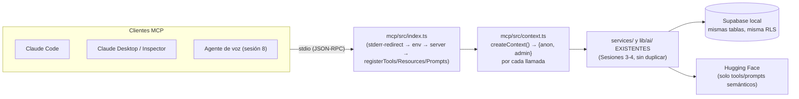

# MercadoTech MCP Server

Servidor [Model Context Protocol](https://modelcontextprotocol.io) (MCP) que expone
MercadoTech — el marketplace de la web (`mercadotech/`) — a cualquier cliente MCP
(Claude Code, Claude Desktop, el Inspector, y en la Sesión 8 el agente de voz).
**Es de solo lectura**: ninguna tool muta datos de la plataforma.

## Qué es, en una frase

Un mostrador de atención aparte de la web: **no cocina nada nuevo** — todo lo que
sirve (10 Tools, 7 Resources, 5 Prompts) sale de los mismos `services/` y `lib/ai/`
que ya usa la web (Sesiones 3-4), reutilizados tal cual, nunca reimplementados.

## Arquitectura



`mcp/src/tools/`, `mcp/src/resources/` y `mcp/src/prompts/` son las tres capas que
un cliente MCP puede pedir; `mcp/src/shared/` son las derivaciones que ningún
service existente resolvía (conteos, "top vendidos", perfil público de un
vendedor) — documentadas como composición, nunca como lógica de negocio nueva.

## Decisiones, con su porqué

- **Contexto por llamada, no singleton al arrancar** (`context.ts`,
  `createContext()`): el proceso puede vivir horas atendiendo muchas
  invocaciones; crear los clientes de Supabase en cada llamada evita que
  credenciales o conexiones queden congeladas desde el arranque.
- **stdout es sagrado**: con transporte stdio, stdout transporta JSON-RPC — un
  solo `console.log` lo corrompe. `mcp/src/lib/stderr-redirect.ts` redirige
  `console.log/info/warn` a stderr, importado como el PRIMER import de
  `index.ts` (en ESM los imports se evalúan antes que cualquier statement
  propio del módulo que los declara — ponerlo "primero" en el texto no basta
  si hay imports arriba).
- **Por qué NO importa `lib/supabase/admin.ts`**: ese archivo empieza con
  `import "server-only"`, un paquete que solo actúa como no-op DENTRO del
  bundler de Next.js — bajo `tsx`/Node puro (como corre este servidor) su
  import lanza incondicionalmente. La prueba ya estaba escrita en este mismo
  repo (`scripts/index-all.ts`, Fase 4.3): `context.ts` reutiliza exactamente
  ese patrón, un cliente admin propio con `@supabase/supabase-js` directo.
- **anon vs admin, explícito por tool/resource**: nunca "admin por comodidad".
  admin solo donde la RLS real lo exige — ver la tabla completa más abajo.
- **env de la RAÍZ, sin `.env` propio en `mcp/`**: una sola fuente de secretos.
  `env.ts` resuelve `mercadotech/.env.local` de forma **robusta al cwd**
  (relativo a la ubicación del propio archivo, no a `process.cwd()`) — ver
  "Por qué `--tsconfig` explícito en `.mcp.json`" abajo para el porqué exacto.

## Variables de entorno

Ninguna propia — reutiliza `mercadotech/.env.local` (ver `mercadotech/.env.example`):
`NEXT_PUBLIC_SUPABASE_URL`, `NEXT_PUBLIC_SUPABASE_ANON_KEY`,
`SUPABASE_SERVICE_ROLE_KEY` (obligatorias, el servidor no arranca sin ellas) y
`HUGGINGFACEHUB_API_TOKEN` (opcional al arrancar — sin ella, las 4 tools que
llaman a Hugging Face degradan con un error de tool accionable, el servidor
sigue vivo).

## Comandos

Todos se corren desde `mcp/` (no desde `mercadotech/` ni desde la raíz del repo):

```bash
cd mcp

npm run dev          # tsx watch src/index.ts — reinicia solo al guardar
npm run build        # tsup → dist/index.js (bundlea el código propio del
                      # repo alcanzado por el alias @/*; deja @modelcontextprotocol/sdk,
                      # zod y @supabase/supabase-js como import normal de node_modules)
npm run start         # node dist/index.js — la versión de producción
npm run type-check   # tsc --noEmit
```

Para inspeccionar el servidor sin Claude Code (ver nota de versión del
Inspector más abajo):

```bash
cd mercadotech
npx @modelcontextprotocol/inspector@0.15.0 npx tsx mcp/src/index.ts
```

## `.mcp.json` y por qué usa `--tsconfig` explícito

`.mcp.json` vive en `mercadotech/.mcp.json` (la raíz del proyecto Next.js, NO
un nivel arriba en la raíz del repo). Esto se corrigió empíricamente en la
Fase 5.5: la primera versión de este archivo vivía en la raíz del repo —
mismo nivel que `.claude/skills/`, que sí se descubre ahí — pero al probar
`/mcp` en una sesión real de Claude Code (interfaz gráfica) el servidor no
aparecía listado en absoluto. Moverlo a `mercadotech/.mcp.json` lo resolvió.
Conclusión (documentada para no repetir el experimento): la ubicación de
`.mcp.json` y la de `.claude/skills/` NO tienen por qué coincidir — cada una
la descubre un mecanismo distinto de Claude Code.

```json
{
  "mcpServers": {
    "mercadotech": {
      "command": "node_modules/.bin/tsx",
      "args": ["--tsconfig", "mcp/tsconfig.json", "mcp/src/index.ts"]
    }
  }
}
```

Dos detalles no obvios, cada uno confirmado con una prueba real antes de
fijar esta forma (no es la forma literal que sugiere la spec de la sesión —
gana lo verificado):

1. **`command` apunta al binario de `tsx` DENTRO de `node_modules/.bin/`, no a
   `npx tsx`.** Más robusto que depender de que `npx` resuelva correctamente
   el `tsx` local del cwd que Claude Code use para lanzar el proceso —
   evita por completo la clase de fallo `ERR_MODULE_NOT_FOUND` que sí
   apareció al probar `.mcp.json` desde la raíz del repo (sin
   `node_modules` propio ahí, `npx tsx` caía a una copia cacheada rota).
2. **`--tsconfig mcp/tsconfig.json` explícito.** La resolución del alias
   `@/*` de `tsx` depende del cwd real del proceso, que no es 100% predecible
   de antemano (confirmado con el mismo experimento del punto anterior:
   lanzado sin este flag desde un directorio sin `tsconfig.json`, ningún
   import `@/services/...` resolvía). Pasarlo explícito lo vuelve
   independiente del cwd.

`env.ts` además resuelve `.env.local` por la ubicación del propio archivo
(`import.meta.url`), no por `process.cwd()` — funciona igual sin importar
desde dónde termine lanzándose el proceso, defensivo ante que el cwd real de
`.mcp.json` no esté 100% documentado.

La primera vez que Claude Code lea `.mcp.json` va a pedir aprobar el servidor
— es el comportamiento esperado, hay que aprobarlo.

### Variante de producción

Tras `npm run build` dentro de `mcp/`, reemplazar `command`/`args` por:

```json
{
  "command": "node",
  "args": ["mcp/dist/index.js"]
}
```

(no necesita `--tsconfig`: `tsup` ya resolvió el alias al bundlear).

## Nota de versión del Inspector

El Inspector en su tag `latest` (v2, actual `2.4.0`) y su propio v1 más
reciente (`1.0.2`) ya exigen Node ≥22.7.5; este proyecto corre en Node
20.20.2 en todo el resto del repo. La última versión sin esa exigencia es
`0.15.0` — se usa pineada explícitamente (`@modelcontextprotocol/inspector@0.15.0`)
en vez de la resolución sin versión de `npx` (hallazgo del Prompt 0 de la
Sesión 5).

## Tools, Resources y Prompts × service reutilizado × cliente

### Tools (10) — todas de solo lectura

| # | Tool | Reutiliza | Cliente | Porqué del cliente |
|---|---|---|---|---|
| 1 | `search_products` | `product.service.listActiveProducts` | anon | productos activos son públicos |
| 2 | `get_product` | `shared/products.getProductDetail` (→ `product.service.{getProductById,getProductImages}` + `review.service.getAverage` + `question.service.listByProduct`) | anon | detalle público, mismos datos que `/producto/[id]` |
| 3 | `list_categories` | `category.service.listCategories` + conteo derivado (`shared/stats.getCategoriesWithCount`) | anon | categorías públicas |
| 4 | `semantic_search_products` | `vector-search.service.searchProducts` | **admin** | `knowledge_embeddings` solo SELECT a `authenticated`; el servidor no tiene sesión de usuario |
| 5 | `ask_assistant` | `chat.service.ask` | **admin** | mismo motivo — pasa por `searchByEmbedding` |
| 6 | `compare_products` | `product.service.getProductsByIds` (agregada en la Fase 5.3) + `review.service.getAverage` | anon | mismos datos públicos, para 2-4 ids |
| 7 | `find_related_products` | `lib/ai/embeddings` + `vector-search.service.searchByEmbedding`, hidratado con `getProductsByIds` | anon+**admin** | producto/categoría de partida públicos; búsqueda semántica exige admin |
| 8 | `summarize_reviews` | `review.service.listByProduct` + `lib/ai/completion` (`REVIEW_SUMMARY_SYSTEM_INSTRUCTIONS`, `lib/ai/prompts.ts`) | anon | reseñas públicas; solo rating+comment viajan al modelo, nunca `buyer_id` |
| 9 | `get_store_stats` | `shared/stats.getStoreStats` (`listActiveProducts` + `getCategoriesWithCount` + `getTopSellingProducts`) | anon+**admin** | conteos públicos + `order_items` (solo admin) |
| 10 | `get_order_status` | `order.service.getOrderById` | **admin** | `orders`/`order_items` exigen ser comprador/vendedor del pedido; lista blanca explícita de campos, nunca `buyer_id` |

### Resources (7)

| URI | Reutiliza | Cliente |
|---|---|---|
| `mercadotech://info` | estático, no toca la BD | — |
| `mercadotech://products` | `shared/products.getAllActiveProductsSummary` | anon |
| `mercadotech://products/{id}` (template) | `shared/products.getProductDetail` (misma función que la tool #2) | anon |
| `mercadotech://categories` | `shared/stats.getCategoriesWithCount` (misma que la tool #3) | anon |
| `mercadotech://sellers/{sellerId}` (template) | `shared/sellers.getSellerProfile` (`profiles.display_name` + `seller.service.listMyProducts` filtrado a activos) | **admin** |
| `mercadotech://faq` | `support-article.service.listPublished` (agregada en la Fase 5.4) | anon |
| `mercadotech://stats` | `shared/stats.getStoreStats` (misma que la tool #9) | anon+**admin** |

`mercadotech://sellers/{sellerId}` expone **SOLO** `display_name` + productos
activos — jamás `phone`, email ni rol (decisión 5 de la spec: `profiles` no
tiene SELECT público, RLS de la Fase 2.3).

### Prompts MCP (5) — no confundir con las Skills de `.claude/skills/`

| Prompt | Argumentos | Reutiliza |
|---|---|---|
| `describir_producto` | `productId` | `product.service.getProductById` |
| `comparar_productos` | `ids` (string separado por coma, 2-4) | `product.service.getProductsByIds` |
| `redactar_respuesta_pregunta` | `questionId` | `question.service.getById` (agregada en la Fase 5.4) + `product.service.getProductById` |
| `resumen_de_resenas` | `productId` | `review.service.listByProduct` (solo rating+comment embebidos) |
| `generar_articulo_faq` | `tema` | `support-article.service.listPublished` (como referencia de estilo) |

Los 5 embeben el contenido real como `type: "resource"` dentro del mensaje
(patrón de ReadHub) — nunca reimplementan recuperación ni el pipeline RAG.

## Si algo falla: síntomas y diagnóstico

| Síntoma | Causa más probable | Qué hacer |
|---|---|---|
| Claude Code no ve el servidor / no aparece en `/mcp` | `.mcp.json` recién creado, sesión vieja, o no se aprobó el servidor | Reiniciar la sesión de Claude Code; aprobar el servidor cuando lo pregunte |
| El Inspector conecta pero "se cae" al primer uso | Algo escribió en stdout | Buscar `console.log` sin redirigir; los logs van a stderr |
| Error de tipos/validación al registrar tools | zod 4 instalado | Pinnear `zod@^3.25.76` en `mcp/package.json` y reinstalar |
| "This module cannot be imported…" al arrancar | Algo importó `lib/supabase/admin.ts` (`server-only`) | El MCP construye sus clientes en `src/context.ts`; revisar imports |
| "Faltan NEXT_PUBLIC_SUPABASE_URL…" | `.env.local` no existe en `mercadotech/`, o falta una variable | Copiar `mercadotech/.env.example` a `mercadotech/.env.local` y llenarlo |
| `Cannot find package '@/services'` | Se lanzó sin `--tsconfig` desde un cwd sin `tsconfig.json` (ver sección de `.mcp.json` arriba) | Agregar `--tsconfig mercadotech/mcp/tsconfig.json` a los args |
| `ERR_MODULE_NOT_FOUND` al lanzar con `npx tsx` desde la raíz del repo | `npx` no encuentra `tsx` local desde un cwd sin `node_modules` | Usar el binario directo: `mercadotech/node_modules/.bin/tsx` |
| Tools semánticas devuelven vacío siempre | Se usó cliente anon contra `knowledge_embeddings` | Esas tools usan admin del contexto — revisar el archivo de la tool |
| Tools semánticas fallan con 401/modelo | Token HF ausente o modelo rotado | Misma tabla de síntomas de la Sesión 4 (`docs/RAG.md`) |
| Una tool/resource falla con "permission denied for table/function X" | `service_role` tiene BYPASSRLS pero no los GRANT normales de Postgres — son mecanismos distintos (hallazgo real de las Fases 5.3/5.4) | Agregar el GRANT que falte en una migración nueva, ver `supabase/migrations/20260828100000_*.sql` como ejemplo |
| Las Skills no se activan | Sesión sin reiniciar tras crearlas | Reiniciar sesión |
